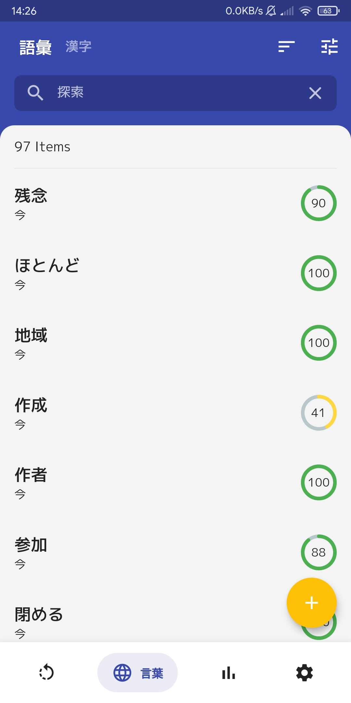
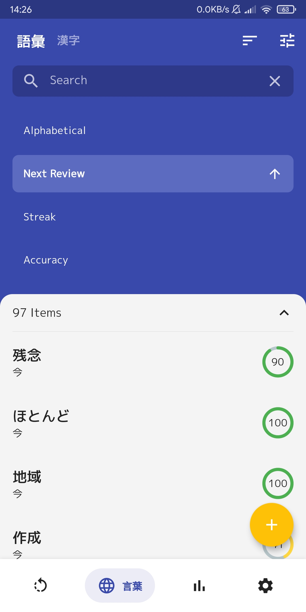
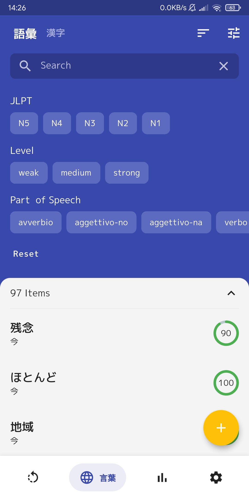
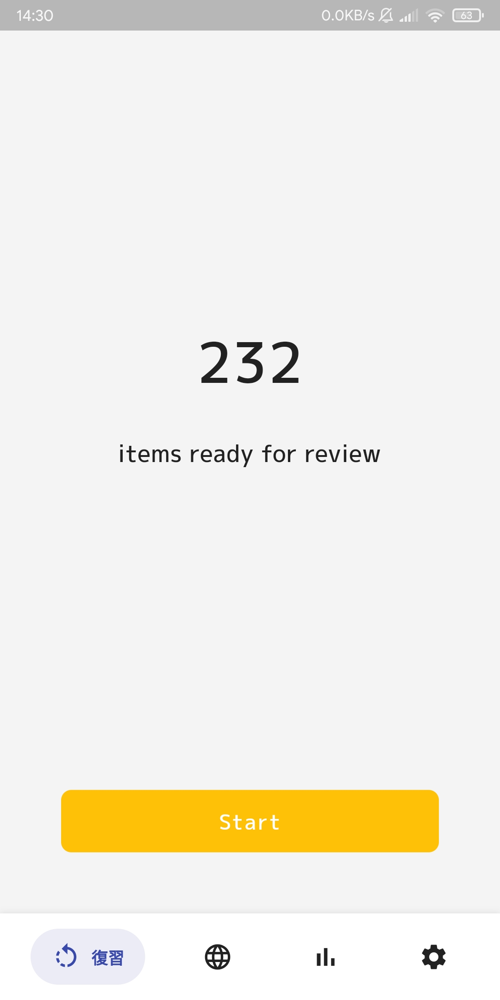
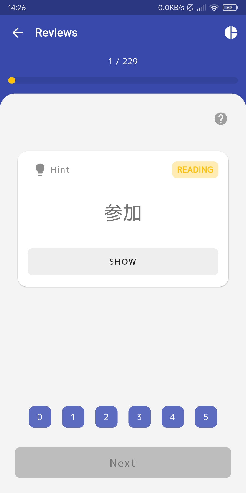
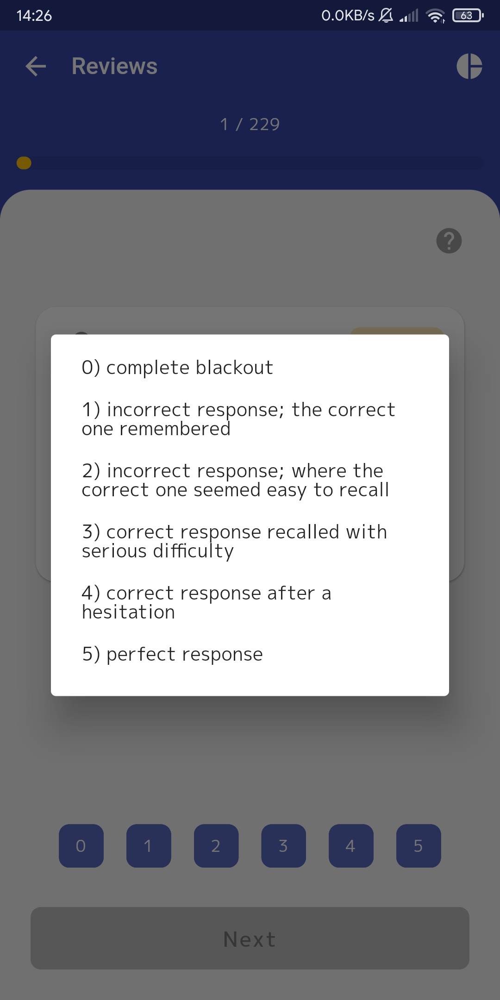
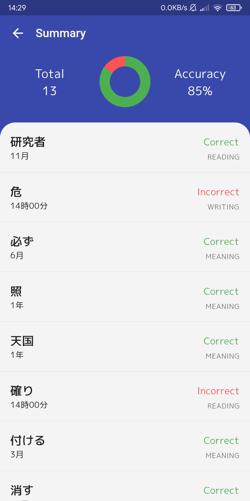

# Jap Vocabs

[](https://github.com/Darklod/jap-vocabs/actions?query=workflow%3Arelease)
[](https://github.com/Darklod/jap-vocabs/actions?query=workflow%3Adev)
[](https://codecov.io/gh/Darklod/jap-vocabs)
[](https://flutter.dev/docs/development/tools/sdk/releases)
[](https://pub.dev/packages/pedantic)
[](https://app.fossa.com/projects/git%2Bgithub.com%2FDarklod%2Fjap-vocabs?ref=badge_shield)

## Screenshots

Vocabulary List   |  Sorting |  Filtering 
:----:|:---:|:--------:
 |  | 

 Review Page | Review Item | Legend | Summary
:----:|:---:|:--------:|:--------:
 |  |  |  |

## To Do

- [ ] Notifications
- [x] Sorting
- [x] Filter
- [ ] Statistics Page
- [ ] Remove, Update examples
- [ ] Automatic Backups
- [ ] Language localization
- [ ] Redesign Add/Edit Page

## Folder Structure

```
lib
├── components                # Common widgets shared between pages
├── database                  # Database configuration and Dao classes
├── models                    # Models
├── pages                     # Page widgets
│   ├─ home                   
│   │  ├── components         # Local widgets used only in the home page
│   │  └── home.dart          
│   ├─ details
│   └─ ...
├── redux                     # Redux folders
│   ├─ actions                
│   ├─ reducers               
│   ├─ state                  
│   ├─ thunk                  
│   └─ store.dart
├── utils                     # Common functions
├── main.dart
└── routes.dart               # Contains the routes and imports all pages.
```

